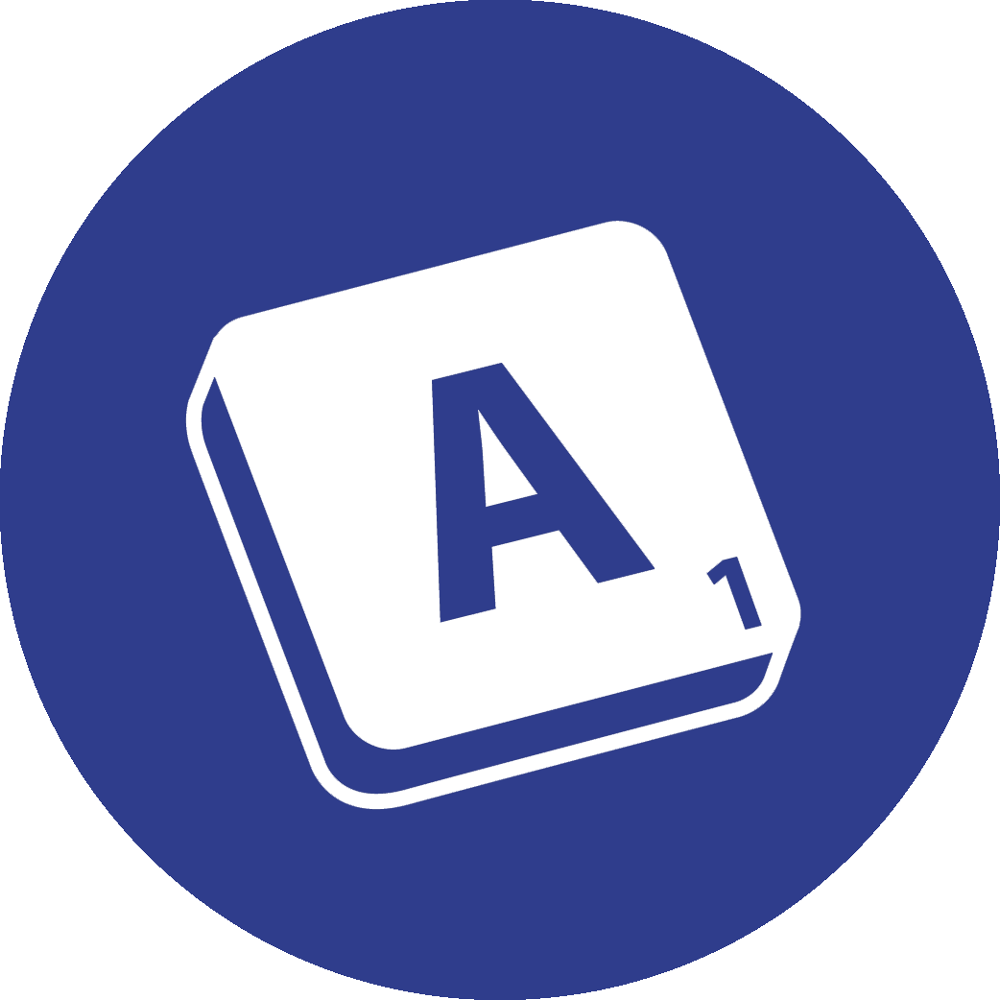
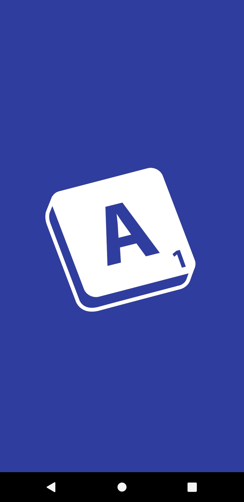
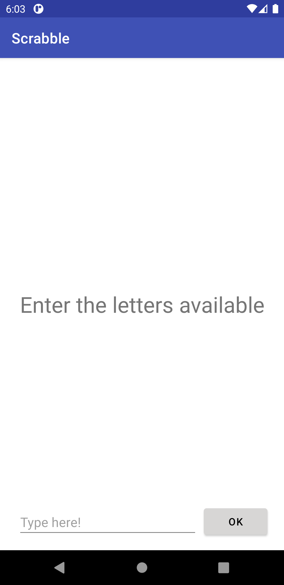
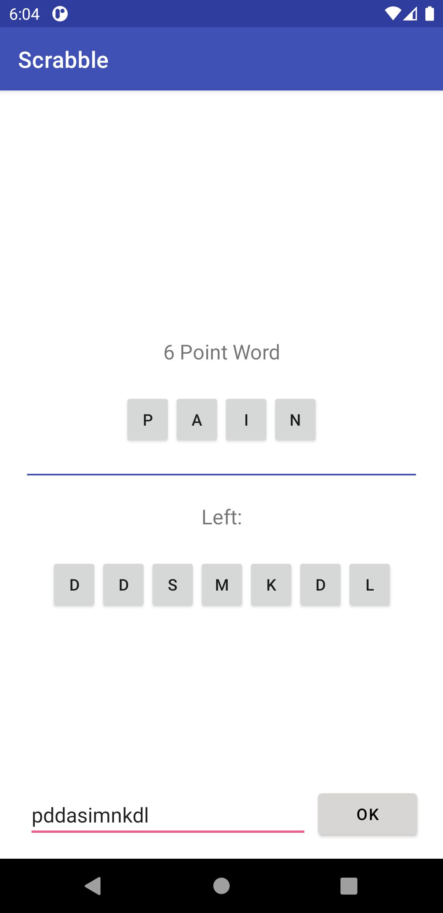

# Scrabble

  

## 📑 About this Project
The idea for this project came from a word game. In this game, each player receives a set of letters and must decide which word formed with those letters will 
account for the largest number of points.

## 📚 Functionality
- Find the word with the highest score in a given set of letters.
- Displays all characters that have not been used to construct the word.

## ♟️ Logic
The logic of the program is based on going through a [Trie](https://wikipedia.org/wiki/Trie) in search of finding all possible words that can be formed with the 
characters entered. After all the words have been found, the algorithm goes through a refinement phase, in which the selected words are validated and those that 
do not respect the frequency of characters are discarded. After this refinement, the point count is made, in which each letter that makes up the word is verified to 
assign the final score and after calculating the value of all words, the word with the highest score is returned.

## 💾 Data
In this application, for a word to be assembled, a dictionary must be consulted. Currently, only a few words are available, but the application works for any word, 
as long as it is in the database.

- Available Words:

      pineapple, herd, order, door, table, die, mangoes, go, things, radiography, math, 
      drugs, buildings, implementation, computer, balloon, cup, boredom, banner, book, 
      leave, superior, profession, meeting, buildings, mountain, botany, bathroom,
      boxes, cursing, infestation, termite, winning, breaded, rats, noise, antecedent,
      company, emissary, slack, break, guava, free, hydraulic, man, dinner, games,
      assembly, manual, cloud, snow, operation, yesterday, duck, foot, trip, cheese, 
      room, backyard, loose, route, jungle, tattoo, tiger, grape, last, reproach, 
      voltage, angry, mockery, pain
    
- Letter Value:

      1 point: E, A, I, O, N, R, T, L, S, U
      2 points: W, D, G
      3 points: B, C, M, P
      4 points: F, H, V
      8 points: J, X
      10 points: Q, Z

## 💡 Why?
This project is part of my personal portfolio and I would be very happy to receive feedback on the project, code, structure, anything that can make me a better developer!

E-mail: <a href="mailto:gabrielcaetanodm@gmail.com">gabrielcaetanodm@gmail.com</a> | 
LinkedIn: <a href="https://www.linkedin.com/in/gabrielcaetanodm/" target="_blank">gabrielcaetanodm</a>

Also, you can use this design as you want, it's free to copy, change and improve.

## 🎨 Design
Native Android design with an adaptive night mode.

<table style="border: none">
    <td></td>
    <td></td>
    <td></td>
</table>

## 📥 How to use

- Clone this repository: `git clone https://github.com/gabriaraujo/scrabble.git`
- Open the project and emulate this application using [Android Studio](https://developer.android.com/studio).

- Alternatively, you can download [`app-debug.apk`](https://github.com/gabriaraujo/scrabble/blob/main/build/app-debug.apk) and run the application on 
your Android device.

## 🚀 Build With
- [Android Studio](https://developer.android.com/studio) - An integrated development environment for developing an Android platform.
- [Kotlin](https://developer.android.com/kotlin) - Is a multiplatform programming language, object oriented and functional, concisely and statically typed, 
which compiles for the Java Virtual Machine and which can also be translated into JavaScript and compiled into native code.
- [Java](https://www.java.com/) - Java is an object-oriented programming language, unlike modern programming languages, which are compiled for native code, 
the Java language is compiled for a bytecode that is interpreted by a virtual machine.

## 📕 License
The software is available under the [MIT License](https://github.com/gabriaraujo/scrabble/blob/main/LICENSE).

## ☕ Questions?
If you have any questions, please feel free to contact me.

Thanks!
